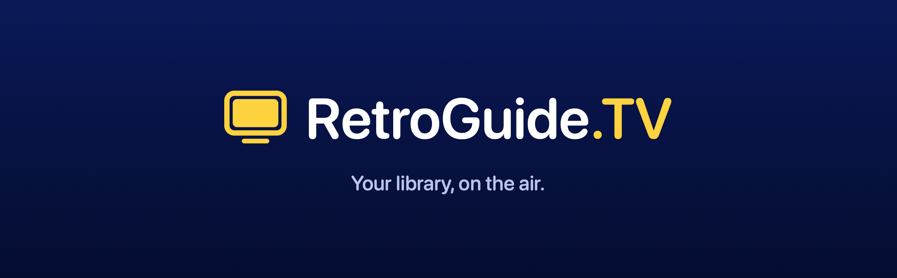
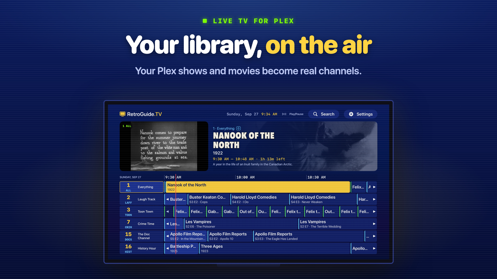
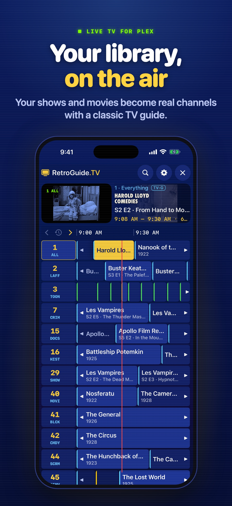

<p align="center">
  
</p>

<p align="center">
  <strong>Your media library, on the air.</strong><br>
  A native app for Apple TV, iPhone and iPad that turns your Plex library into live TV channels with a classic program guide.
</p>

---

RetroGuide.TV builds dozens of always-on channels from the shows and movies you
already have: comedy, anime, sci-fi, 90s TV, 24/7 marathons of your favorite
series, and more. Turn it on and something is already playing. Flip channels with
the Siri Remote or a swipe, drop into whatever's on mid-episode, and browse what's
next in a cable-style guide.

## Download

[Get RetroGuide.TV on the App Store](https://apps.apple.com/app/apple-store/id6816213425?pt=128673019&ct=github_readme&mt=8)
for Apple TV, iPhone and iPad.

You need a Plex Media Server you own or that is shared with you. **No media is
included.** Apple TV is free with no ads; the free iPhone and iPad app shows ads.
An optional one-time RetroGuide Pro purchase removes mobile ads and unlocks
multiple servers, unlimited custom channels, all themes and schedule controls
across all three devices.

[Setup and support](https://zeronexus.net/retroguide/support/) ·
[Privacy Policy](https://zeronexus.net/retroguide/privacy/)

## Screenshots



<p align="center">
  
</p>

Actual interfaces shown with a public-domain demo library. Your channels are
built from your own Plex media. [Screenshot credits](docs/images/CREDITS.md).

## Features

- **Automatic channels.** 50+ built-in genre, decade and format channels, plus
  channels for each library, TV network, large collection and long-running show.
  Channels with too little content are skipped, duplicates are removed, and the
  lineup scales to the size of your library.
- **Works with any library.** Genres are normalized across Plex agents and
  languages (for example "Sci-Fi & Fantasy", "Science Fiction" and "Komödie"), and
  anime is recognized even without an "Anime" genre tag.
- **Custom channels.** Combine genres, shows, networks, collections, decades,
  audiences and libraries, with a live preview of what the channel will air.
  One custom channel is free; unlimited custom channels require Pro.
- **Real TV scheduling (Pro controls).** Every channel runs on a fixed clock, so with the same
  library and settings, the same program is on at the same time on every Apple TV. Choose Shuffle, Block
  Shuffle, Show Rotation or Marathon ordering per channel, and optionally align
  start times to the quarter or half hour.
- **Program guide.** A focus-driven grid with a live preview, "now" line,
  rating colors, show logos and artwork, and search with live results.
- **Channel surfing.** Swipe to change channels, with static between channels,
  a glowing channel number and an info banner, and a button for the last
  channel.
- **Apple TV, iPhone and iPad.** Built for the Siri Remote on Apple TV and for
  touch on iPhone and iPad, in portrait or landscape.
- **Direct play.** A bundled [libmpv](https://mpv.io) player plays MKV, HEVC,
  AV1, Dolby Vision, DTS, TrueHD and ASS subtitles. Compatible files play
  directly; playback requirements depend on the file, device and server settings.
  Apple's player is available as a fallback.
- **HDR.** HDR10, HLG and Dolby Vision play in HDR on HDR iPhones and iPads. On
  Apple TV, **Match TV mode** switches the TV into HDR (and optionally to each
  program's frame rate) when Match Content is on in the Apple TV's settings.
- **Respects your Plex settings.** Audio and subtitle tracks follow your Plex
  account's language preferences and per-show choices.
- **Multiple servers (Pro).** Mix your own server with ones shared with you. The same
  title on several servers is kept once, offline servers drop out of the guide
  until they're back, and each server has its own quality and buffering
  settings for playback over the internet.
- **Themes (all twelve with Pro).** Twelve themes, from Classic Cable and Local Forecast to VHS and
  Teletext, and optional CRT scanlines on menus.

## Free and Pro

The App Store version is free with ads on iPhone and iPad (Apple TV has no
ads): a standard banner under the menus and, at most once per 90 minutes of
watching, a full-screen ad at a natural break. RetroGuide Pro is a one-time
purchase that removes ads and adds multiple servers, unlimited custom
channels, every theme, and schedule controls. One purchase covers iPhone, iPad
and Apple TV. Pro is $9.99 in the US App Store; local pricing may vary.
See the price in the app before purchasing. The free version includes one custom
channel.

## Requirements

- Apple TV with tvOS 17 or later (Apple TV 4K recommended), or iPhone or iPad
  with iOS 17 or later
- A Plex Media Server you own or that is shared with you. Servers outside your
  home must have Plex Remote Access enabled.

No shows, movies or broadcast channels are included. The app interface is English.
Jellyfin is not supported yet.

## Getting started

1. Open RetroGuide.TV and choose **Connect Plex**.
2. Go to [plex.tv/link](https://plex.tv/link) and enter the code shown on screen.
   On Apple TV you can scan the QR code; on iPhone and iPad, tap
   **Open plex.tv/link**.
3. Pick a server and the libraries to include, then choose **Build My Channels**.

Live TV starts as soon as your first server is indexed. Add more servers later in
**Settings → Servers**.

### Siri Remote

| Where | Button | Action |
| --- | --- | --- |
| Watching | Swipe up / down | Channel up / down |
| Watching | Swipe left / right | What's on now / next |
| Watching | Click | Open the guide |
| Watching | Play/Pause | Last channel |
| Guide | Click | Watch the highlighted channel |
| Guide | Play/Pause | Jump to Search and Settings |
| Anywhere | Menu | Back |

### Touch (iPhone and iPad)

| Where | Gesture | Action |
| --- | --- | --- |
| Watching | Swipe up / down | Channel up / down |
| Watching | Swipe right / left | What's on now / next |
| Watching | Tap | Show the info banner and controls (Guide, last channel, channel up / down) |
| Guide | Tap a program | Preview it; tap again or press Watch to tune |
| Guide | Tap a channel number | Watch that channel |
| Guide | Swipe sideways, or ‹ Now › | Move through the schedule |
| Search, Settings | Tap the corner picture | Back to full-screen TV |

## How it works

- **Indexing.** RetroGuide.TV reads your library metadata from Plex once and
  caches it on the Apple TV, refreshing when it's more than six hours old. It
  doesn't affect watch history. In the current App Store app, your selected audio
  and subtitle preferences can also be saved to Plex and synced through iCloud.
- **Scheduling.** Each channel's schedule is computed from the channel's content
  and a fixed epoch rather than stored. Every schedule cycle plays each item on
  the channel once, in an order seeded by the channel and the cycle number.
  "What's on now" is simple arithmetic, so schedules never need rebuilding.
- **Playback.** Only one stream plays at a time. Channel changes wait a moment
  while you're flipping, and the previous stream is released before the next one
  starts. With the default player the server just sends the original file, like
  any direct play.

## Privacy

RetroGuide.TV has no separate account system; you link your Plex account to find
and use your servers. Plex tokens are stored in the device keychain. Library
metadata and local settings are cached on your device; chosen audio and subtitle
preferences can also be saved to Plex and synced through iCloud.

The free iPhone and iPad app requests non-personalized ads from Google AdMob.
Non-personalized ads still involve data processing for advertising, measurement
and fraud prevention. Google's consent form appears where required, with
applicable privacy choices in Settings. Apple TV and RetroGuide Pro show no ads.
See the [Privacy Policy](https://zeronexus.net/retroguide/privacy/) for details.

## Building from source

Requirements: macOS with Xcode 26 or later.

```bash
git clone https://github.com/shikyo13/RetroGuide.TV.git
cd RetroGuide.TV
open RetroGuide.xcodeproj
```

Choose the **RetroGuide** scheme and an Apple TV, iPhone or iPad simulator, then
run. To run on a device or archive, copy `Config/Local.xcconfig.example` to `Config/Local.xcconfig`
and set your Apple Developer Team ID (that file is git-ignored).

The Xcode project is generated from `project.yml` with
[XcodeGen](https://github.com/yonaskolb/XcodeGen). After changing `project.yml`,
run `xcodegen generate` and commit the updated project.

Run the core library's tests with:

```bash
swift test --package-path Packages/RetroGuideKit
```

### Project layout

```
App/                      App for tvOS, iOS and iPadOS (SwiftUI)
  Composition/            App state, servers, lineup building
  DesignSystem/           Tokens, themes and shared components
  Features/               Onboarding, Watch (player + guide), Search, Settings
  Services/               Playback engines, images, persistence
Packages/RetroGuideKit/   Platform-independent core: models, channel rules,
                          scheduling, search and the Plex client (unit tested)
Tools/BrandAssets/        Generates the app icon and Top Shelf images
Scripts/                  Build phase scripts
```

See [docs/ARCHITECTURE.md](docs/ARCHITECTURE.md) for a deeper tour.

## Contributing

Bug reports, ideas and pull requests are welcome. Please read
[CONTRIBUTING.md](CONTRIBUTING.md) first.

## License

RetroGuide.TV is released under the [MIT License](LICENSE). It bundles
[MPVKit](https://github.com/mpvkit/MPVKit) (libmpv and FFmpeg) under the GNU LGPL
v3.0; see [NOTICE.md](NOTICE.md).

RetroGuide.TV is an independent project and is not affiliated with or endorsed
by Plex, Inc. Plex is a trademark of Plex, Inc.
